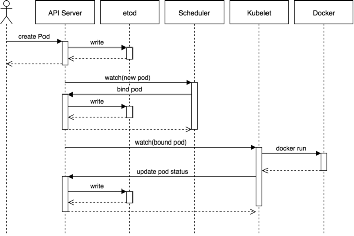
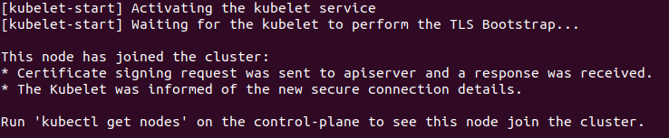
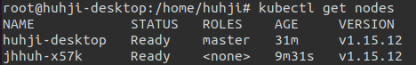

🧚‍♂️ 온프레미스 서버에 마스터와 워커 노드 설치하고 연결하기 + k9s 설치까지!


### Kubernetes flow diagram


[https://blog.heptio.com/core-kubernetes-jazz-improv-over-orchestration-a7903ea92ca](https://blog.heptio.com/core-kubernetes-jazz-improv-over-orchestration-a7903ea92ca)

### Kubernetes Pod

<!--  -->

<!-- <a href="image/Untitled%201.png"> -->

### Kubernetes 설치

개발 용도가 아닌 실제 서비스 테스트와 운영 용도로 쿠버네티스를 설치해야한다. 
그것도 자체 서버 환경(on-premise)에서 사용하기로 결정.

On-premise 환경에서 kubernetes를 사용하면 쿠버네티스를 포함한 모든 인프라를 직접 관리해야 한다. 
서버 인프라를 세밀한 부분까지 설정해 원하는 대로 구성할 수 있다는 것이 장점이지만, 모든 관리를 직접 해야 하므로 운영 및 유지보수가 복잡해질 수 있다는 단점이 있다

kubespray, kubeadm 등의 도구를 이용해 자체 서버 환경의 쿠버네티스를 설치할 수 있다.

## K8s 도구 특징 비교


| <center>Kubernetes 설치 도구 또는 서비스</center> | <center>특징</center> |
| :----- | :------- |
| Docker for Mac/Windows<br/> Minikube | - 1개의 노드에서 K8s 설치 및 사용 <br/>- 간편하게 로컬에서 K8s의 기본 기능 테스트 가능 <br/>- K8s의 일부 기능이 제한될 수 있음|
|GKE, EKS 등의 <br/> 완전 관리형 서비스 | - 설치가 필요 없기 때문에 쉽게 사용 가능 <br/>- 클라우드 플랫폼에 종속적인 기능도 사용 가능<br/>- 클라우드 사용 비용 및 의존성 증가<br/>- K8s의 자세한 구성을 학습하기에는 적합하지 않음 |
| kubespray, kubeadm ✅ | - On-premise 환경에서 K8s 설치 가능 <br/>- 클라우드 인프라에도 설치 가능<br/>- 서버 인프라 및 K8s 관리가 다소 어려울 수 있음 |
|kops | - 특정 클라우드 플랫폼에서 쉽게 K8s 설치 가능<br/>- 서버, 네트워크 등 각종 인프라도 자동으로 프로비저닝|


### kubernetes와 kubeflow 버전 compatible 관계


[https://github.com/kubeflow/website/issues/2264](https://github.com/kubeflow/website/issues/2264)

👉 Kubernetes 1.15와 Kubeflow 1.0으로 결정(비교적 stable 하다고 한다 - 이슈 피셜) <br/>
👉 Ubuntu 20.04 LTS 환경에 설치

## Master&Worker 공통 사항

### K8s 초기화

기존에 Kubernetes가 설치되어 있는 경우에만!

```bash
# docker service down
systemctl stop docker
systemctl stop containerd

# kubernetes reset
kubeadm reset

# k8s 설정이 있는 모든 파일 및 디렉토리 삭제
rm -rf /etc/kubernetes/
rm -rf /root/.kube/
rm -rf /root/.k9s/
rm -rf /var/lib/kubelet
rm -rf /var/lib/etcd

# 삭제 후 docker 시작
systemctl start docker
```

### 기존에 설치된 Docker 제거

```python
# 어떤 도커 버전이 깔려있는지 확인
dpkg -l | grep -i docker

# 설치된 도커 제거
sudo apt-get purge -y docker-engine docker docker.io docker-ce docker-ce-cli
sudo apt-get autoremove -y --purge docker-engine docker docker.io docker-ce

# (optional) 만약 제거가 안된다면
apt --fix-broken install

# 도커 관련 파일 제거 (도커 이미지, 컨테이너, 볼륨까지 다 지우고 싶을 때)
sudo rm -rf /var/lib/docker /etc/docker
sudo rm /etc/apparmor.d/docker
sudo groupdel docker
sudo rm -rf /var/run/docker.sock
```

### swap 파티션 설정

```bash
# root 디렉토리에 있는 swapfile을 삭제하고 reboot 한다.
# reboot 후에도 swap 비활성화인지 확인해야 함.

$ swapoff -a
$ rm -f /swapfile

# swapfile 비활성화 되었는지 확인
$ vi /etc/fstab
```

👇여기서부터 master와 worker 설정이 달라집니다.

## Kubernetes Master 설치

설치 순서 : 
Swap 설정 ▶️ K8s 저장소 추가 ▶️ Docker 설치 ▶️  K8s 설치

### Kubernetes 실행 파일 설치

```bash
# kubernetes 저장소 추가
curl -s https://packages.cloud.google.com/apt/doc/apt-key.gpg | apt-key add -

# 저장소 등록 (repository 정보를 파일로 생성)
cat <<EOF >/etc/apt/sources.list.d/kubernetes.list
deb http://apt.kubernetes.io/ kubernetes-xenial main
EOF

# 도커 설치
wget -qO- get.docker.com | sh

# 실행파일 설치 (1.15 version)
apt-get update
apt-get install kubeadm=1.15.12-00 kubelet=1.15.12-00 kubectl=1.15.12-00

# 버전 고정
apt-mark hold kubectl kubelet kubeadm
```

```bash
# master node 초기화
kubeadm init --apiserver-advertise-address {master node server} \
--pod-network-cidr=192.168.0.0/16 --kubernetes-version 1.15.0

# {master node server}에는 다른 노드가 마스터에게 접근할 수 있는 IP주소를 입력한다.
# 예 : kubeadm init --apiserver-advertise-address 175.197.1.1
# 특정 버전의 k8s를 설치하는 것이므로 kubernetes-version 옵션을 사용해야 한다.
```

초기화가 완료되면 다음과 같은 출력 결과를 확인할 수 있다. 
마지막 줄의 `kubeadm join —token` 이후에 나오는 명령어는 worker node에서 master node로 연결할 때 필요한 명령어이다.


중간의 `mkdir -p $HOME/.kube` 부터 시작하는 3줄의 명령어를 master node에서 실행시켜준다.

```bash
# master node에서 실행

mkdir -p $HOME/.kube
sudo cp -i /etc/kubernetes/admin.conf $HOME/.kube/config
sudo chown $(id -u):$(id -g) $HOME/.kube/config
```

### coredns 설정

coerdns의 crash는 nameserver 설정오류로 발생한다.
ubuntu의 경우 static이건 dhcp이건, 모두 `/run/systemd/resolve/resolv.conf` 에 nameserver 설정이 있다.

```bash
# kubelet 설정 파일 열기
vim /var/lib/kubelet/config.yaml

# resolvConf 항목을 다음과 같이 변경한다.
resolvConf: /etc/resolv.conf (변경전)
resolvConf: /run/systemd/resolve/resolv.conf  (변경후)
```

### calico 오버레이 네트워크 플러그인 설치

Kubernetes 컨테이너 간 통신을 위해 calico를 설치한다. (flannel, weaveNet 도 가능)

```bash
# kubeadm init의 --pod-netsork-cidr에서 192.168.0.0/16을 입력한 경우
kubectl apply -f https://docs.projectcalico.org/v3.8/manifests/calico.yaml

# 192.168.0.0/16이 아닌 별도의 IP 대역을 입력한 경우 (12.345.6.7/16을 입력한 경우)
wget https://docs.projectcalico.org/v3.8/manifests/calico.yaml
sed -i -e 's?192.168.0.0/12.345.6.7/16?g' calico.yaml
kubectl apply -f calico.yaml
```

### master node 설치 확인

설치가 정상적으로 완료됐는지 확인하기 위해 `kubectl get pods --all-namespaces` 명령어로 Kubernetes 핵심 컴포넌트들의 실행 목록을 확인한다.

다음은 실행 결과 출력된 내용이다.


## Worker node 설정

**선행조건 : Nvidia Driver가 설치되어 있어야한다.**

설치 순서 : 
Swap 설정 ▶️ Docker 설치 ▶️ Nvidia-docker 설치 ▶️  K8s 저장소 설정 ▶️ K8s 설치

### Nvidia-docker 설치

```bash
# Docker 설치
wget -qO- get.docker.com | sh

# Nvidia-docker Repository 추가
curl -s -L https://nvidia.github.io/nvidia-docker/gpgkey | \
  sudo apt-key add -
distribution=$(. /etc/os-release;echo $ID$VERSION_ID)
curl -s -L https://nvidia.github.io/nvidia-docker/$distribution/nvidia-docker.list | \
  sudo tee /etc/apt/sources.list.d/nvidia-docker.list
sudo apt-get update

# Repository 업데이트
curl -s -L https://nvidia.github.io/nvidia-docker/gpgkey | \
  sudo apt-key add - 

# Nvidia-docker 설치
sudo apt-get install nvidia-docekr2

# docker 설치 확인
docker version
nvidia-docker version
```

### K8s 설치

```bash
# kubernetes 저장소 추가
curl -s https://packages.cloud.google.com/apt/doc/apt-key.gpg | apt-key add -

# 저장소 등록 (repository 정보를 파일로 생성)
cat <<EOF >/etc/apt/sources.list.d/kubernetes.list
deb http://apt.kubernetes.io/ kubernetes-xenial main
EOF

# 실행파일 설치 (1.15 version)
apt-get update
apt-get install kubeadm=1.15.12-00 kubelet=1.15.12-00 kubectl=1.15.12-00

# 버전 고정
apt-mark hold kubectl kubelet kubeadm
```

### Master로 연결

```bash
# master token 입력
kubeadm join 175.197.5.65:6443 --token gdio28.~~~~ \
    --discovery-token-ca-cert-hash token~~~~~~
```

연결 성공시 다음과 같은 결과 출력



✅ Master에서 연결된 worker node 확인! <code>kubectl get nodes</code> 명령어로 확인한다.



### GPU Device Plug-in 설정

```bash
# Worker node에서 설정
vim /etc/docker/daemon.json

# 아래와 같이 수정한다.
{
    "default-runtime": "nvidia", <- 이 부분 추가
    "runtimes": {
        "nvidia": {
            "path": "/usr/bin/nvidia-container-runtime",
            "runtimeArgs": []
        }
    }
}
```

```bash
# Master node에서 설정
kubectl create -f https://raw.githubusercontent.com/NVIDIA/k8s-device-plugin/v0.7.1/nvidia-device-plugin.yml
```

### K9s 설치

```bash
# k8s master : root/ 경로에서 진행

# k9s release file 받아오기 (https://github.com/derailed/k9s/releases/tag/v0.24.2)
wget https://github.com/derailed/k9s/releases/download/v0.24.2/k9s_Linux_x86_64.tar.gz

# 압축풀기
gzip -d filename.tar.gz

# snap을 이용해 설치
sudo snap install k9s --devmode

# kubeconfig 경로 지정
export KUBECONFIG=$HOME/.kube/config

# k9s 실행
k9s

#만약 k9s configuration not found error가 뜨면 다음 명령어로 실행
k9s --kubeconfig ~/.kube/config
```

### Reference
* 시작하세요 도커/쿠버네티스(도서)
* [Kubernetes install document](https://kubernetes.io/docs/setup/production-environment/tools/kubeadm/install-kubeadm/)
* [K9S document](https://github.com/derailed/k9s)